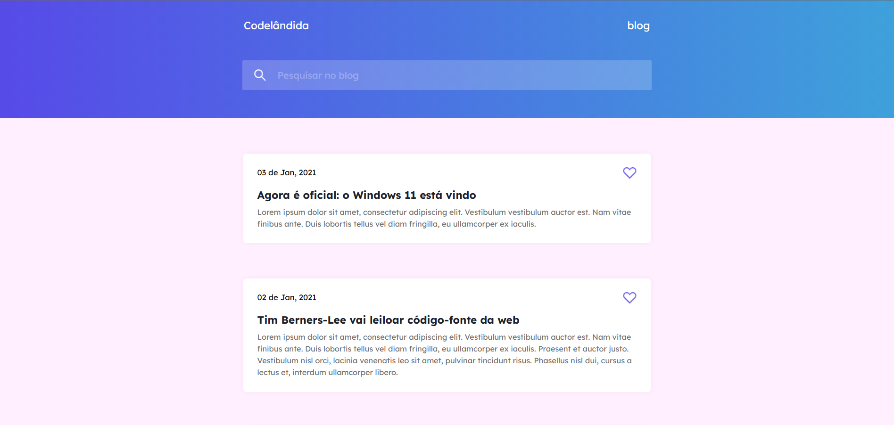
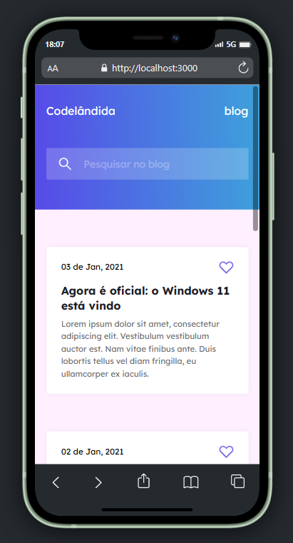

<h1 align="center"> 
	Desafio Codelândia
</h1>

## 💻 Sobre o projeto


Projeto foi feito com o intuito de colocar em prática os meus conhecimentos utilizando React

O proejto do figma é um dos projetos disponíveis no servidor do discord Codelândia.

Link do servidor: https://discord.gg/wNCWTVuxyz <br>
Link do figma:  https://www.figma.com/file/Yb9IBH56g7T1hdIyZ3BMNO/Codel%C3%A2ndia-Desafios?node-id=0%3A1

---
<br>

## 💻 Demosntração
<a href="">
  <br>
  
</a>

---

## 🚀 Como executar o projeto

### Pré-requisitos
Antes de tudo, é preciso cerfiticar-se que você tenha instalado na sua máquina as seguintes ferramentas: 
[Git](https://git-scm.com), [Node.js](https://nodejs.org/en/) e um editor de código. Sugiro: [VSCode](https://code.visualstudio.com/)

#### 🎲 Início

```bash
# Clone este repositório
$ git clone https://github.com/ndluz/desafio-codelandia-1.git
# Instale as dependências
$ npm install
# Inicialize com
$ npm start
```

---

